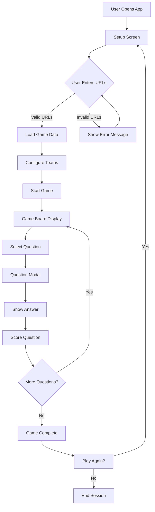
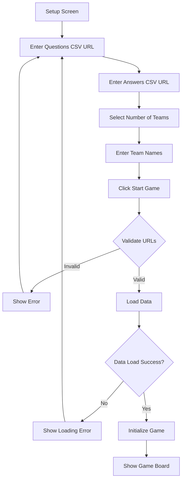
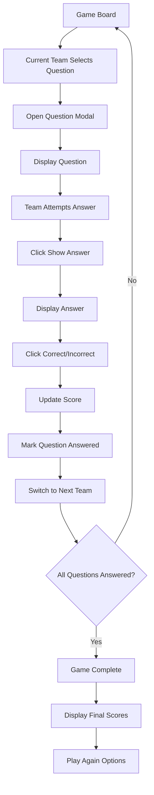
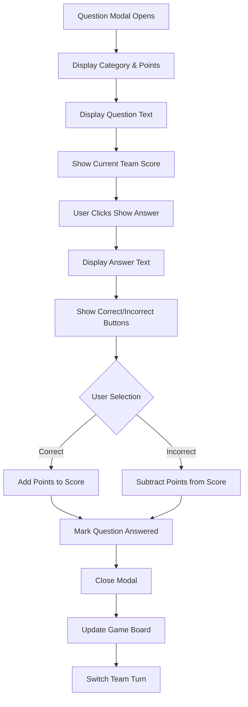
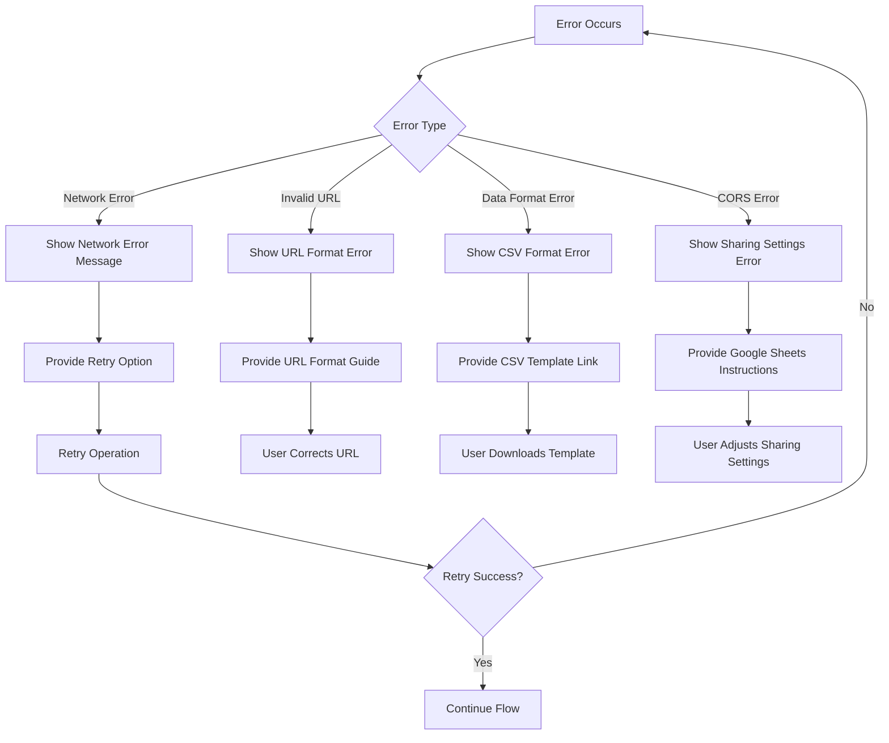

# User Flow Documentation
## Jeopardy Web App

### User Flow Overview
The Jeopardy web app follows a simple, linear user flow from setup to gameplay completion. The application is designed to be intuitive and require minimal user training.

## Mermaid Flow Diagrams

### 1. Main Application Flow

### 2. Setup Flow

### 3. Gameplay Flow

### 4. Question Modal Flow

### 5. Error Handling Flow

## Detailed User Flow Descriptions

### 1. User Onboarding Flow

#### Setup Phase
**Steps:**
1. **URL Input:** User pastes Google Sheets CSV URLs for questions and answers
2. **Team Configuration:** User selects number of teams (1-5) and enters team names
3. **Data Validation:** System validates URLs and loads data
4. **Game Initialization:** System builds game board and prepares for gameplay

**Screen Interactions:**
- **URL Input Fields:** Text input with placeholder text and validation
- **Team Selection:** Radio buttons for team count (1-5)
- **Team Name Inputs:** Dynamic text fields based on team count selection
- **Start Button:** Primary action button to begin game
- **Error Messages:** Clear, actionable error messages for validation failures

**Error Handling:**
- Invalid URL format → Show URL format guide
- Network errors → Show retry option with helpful message
- Data format errors → Provide CSV template and instructions
- CORS issues → Provide Google Sheets sharing instructions

### 2. Core User Journey

#### Gameplay Phase
**Steps:**
1. **Question Selection:** Current team clicks on a point value cell
2. **Question Display:** Modal opens showing category, points, and question
3. **Answer Attempt:** Team discusses and attempts to answer
4. **Answer Reveal:** Host clicks "Show Answer" to reveal correct answer
5. **Scoring:** Host clicks "Correct" or "Incorrect" based on team's answer
6. **Turn Transition:** System automatically moves to next team
7. **Board Update:** Selected question is marked as answered

**Screen Interactions:**
- **Game Board:** 6×6 grid with category headers and point values
- **Question Modal:** Overlay with question text, answer reveal, and scoring buttons
- **Score Display:** Real-time score updates for all teams
- **Current Team Indicator:** Yellow border highlighting active team

**Game Logic:**
- Correct answers: Add points to team score
- Incorrect answers: Subtract points from team score
- Automatic turn rotation after each question
- Visual feedback for answered questions

### 3. Page Interactions

#### Setup Page Interactions
- **Form Validation:** Real-time validation of URL format
- **Dynamic Team Fields:** Show/hide team name inputs based on selection
- **Loading States:** Disable button and show loading indicator during data fetch
- **Error Recovery:** Clear error messages and allow retry

#### Game Board Interactions
- **Clickable Cells:** Only unanswered questions are clickable
- **Visual Feedback:** Hover effects and cursor changes for interactive elements
- **Responsive Design:** Grid adjusts to screen size
- **Accessibility:** Keyboard navigation and screen reader support

#### Modal Interactions
- **Overlay Click:** Click outside modal to close (optional)
- **Close Button:** X button in top-right corner
- **Button States:** Disable buttons during transitions
- **Score Display:** Real-time score updates within modal

### 4. Error Handling During User Flows

#### Network Errors
- **Detection:** Failed fetch requests
- **User Experience:** Clear error message with retry option
- **Recovery:** Automatic retry with exponential backoff
- **Fallback:** Option to use local example data

#### Data Format Errors
- **Detection:** CSV parsing failures or structure mismatches
- **User Experience:** Specific error messages with guidance
- **Recovery:** Provide template files and formatting instructions
- **Validation:** Real-time format checking

#### User Input Errors
- **Detection:** Invalid URLs, empty required fields
- **User Experience:** Inline validation with helpful messages
- **Prevention:** Disable submit button until valid input
- **Guidance:** Tooltips and help text for complex fields

### 5. Edge Cases

#### Offline Mode
- **Detection:** Network connectivity loss
- **User Experience:** Graceful degradation with cached data
- **Recovery:** Automatic retry when connection restored
- **Fallback:** Local example data if no cache available

#### Incomplete Data
- **Detection:** Missing questions or mismatched categories
- **User Experience:** Warning messages with data validation
- **Recovery:** Skip invalid data and continue with available questions
- **Guidance:** Instructions for fixing data format

#### Browser Compatibility
- **Detection:** Feature support checking
- **User Experience:** Feature detection with fallbacks
- **Recovery:** Progressive enhancement approach
- **Guidance:** Browser upgrade recommendations

### 6. Alternative Flows

#### Guest Mode
- **Entry Point:** Direct access to game with example data
- **User Experience:** Pre-loaded sample questions
- **Limitations:** No custom data loading
- **Conversion:** Easy transition to full setup

#### Quick Start
- **Entry Point:** One-click setup with default settings
- **User Experience:** Minimal configuration required
- **Customization:** Post-setup option to modify settings
- **Efficiency:** Faster time to first game

#### Game Recovery
- **Entry Point:** Resume interrupted game
- **User Experience:** Load previous game state
- **Data Source:** Local storage or session data
- **Validation:** Verify data integrity before resuming

### 7. User Permissions

#### Current Implementation
- **No Authentication:** Public access application
- **No User Accounts:** No registration required
- **No Data Privacy:** All data is public and temporary
- **No Restrictions:** Full access to all features

#### Future Enhancement Options
- **User Accounts:** Registration and login system
- **Private Games:** Password-protected game sets
- **Admin Roles:** Game moderator permissions
- **Data Ownership:** User-created content management

### 8. Notifications

#### Current Implementation
- **No Notifications:** No push or email notifications
- **Visual Feedback:** Real-time UI updates only
- **Sound Effects:** None (future enhancement)
- **Status Messages:** Inline status updates

#### Future Enhancement Options
- **Sound Effects:** Classic Jeopardy theme and effects
- **Visual Alerts:** Animated notifications for events
- **Timer Notifications:** Countdown warnings
- **Achievement Notifications:** Milestone celebrations
